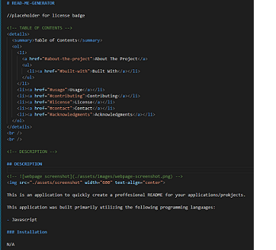

# READ-ME-GENERATOR

[]

<!-- TABLE OF CONTENTS -->

  
Table of Contents

  <ol>
    <li>
      <a href="#about-the-project">About The Project</a>
      <ul>
        <li><a href="#built-with">Built With</a></li>
      </ul>
    </li>
    <li><a href="#usage">Usage</a></li>
    <li><a href="#contributing">Contributing</a></li>
    <li><a href="#license">License</a></li>
    <li><a href="#contact">Contact</a></li>
    <li><a href="#acknowledgments">Acknowledgments</a></li>
  </ol>

 
 

<!-- DESCRIPTION -->

## DESCRIPTION

<!--  -->

This is an application to quickly create a proffesional README for your applications/prokjects.

This application was built primarily utilizing the following programming languages:

- Javascript

### Installation

N/A

<!-- USAGE EXAMPLES -->

## Usage

This application can be used my running the index.js through the command line. Install node.js if you do not have it. Then navigate to the location of the index.js file and run it by typing 'node index.js'. Follow the prompts and when you are done it will create the README.md for you!

<!-- CONTRIBUTORING -->

## Contributing

N/A

<!-- LICENSE -->

## License

See MIT LICENSE for more information.

<!-- TEST -->

## TEST

N/A

<!-- Questions -->

## Questions?

Github Profile : <a href="https://github.com/matwll">matwll</a>
For questions [Email me @](mailto: maw01091989@gmail.com)
